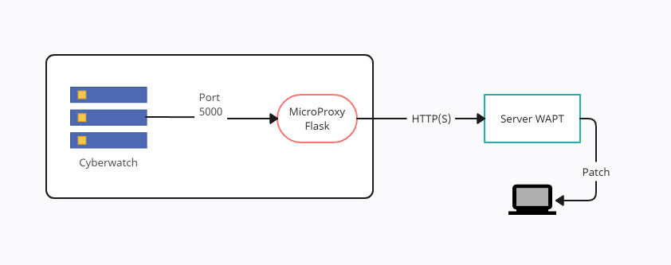

## Mise en place du service WAPT avec Cyberwatch

### Configuration WAPT

1. **Création d'un compte de service :** Commencez par créer un compte de service doté de droits d'administrateur dans la console WAPT.

2. **Génération d'un certificat SSL :** Procédez ensuite à la génération d'un certificat SSL depuis la console WAPT.

3. **Assignation du certificat SSL :** Associez le certificat SSL précédemment généré au compte de service que vous avez créé.

### Configuration du proxy

4. **Préparation du serveur :** Placez les fichiers `wapt.py`, `integration.conf`, le fichier `.crt` et le fichier `.pem` du certificat WAPT sur le serveur Cyberwatch. 

Note : il faut que le serveur avec `wapt.py` soit équipé d'un agent WAPT afin d'avoir les dépendances nécessaires pour l'intégration.
Si nécessaire, l'agent WAPT est disponible à cette adresse : [https://wapt.tranquil.it/wapt/releases/latest/](https://wapt.tranquil.it/wapt/releases/latest/)

5. **Configuration :** Modifiez le fichier `integration.conf` en insérant les valeurs appropriées et les clés d'API Cyberwatch.

6. **Test :** Pour tester le fonctionnement, lancez le proxy en utilisant la commande ` sudo /opt/wapt/waptpython.sh wapt.py`.

### Configuration de Cyberwatch

7. **Intégration à Cyberwatch :** dans la section "Administration/Integrations" de Cyberwatch, ajoutez une intégration avec la configuration suivante :

    - Emplacement : Onglet "Gestion de Correctifs"
    - URL de la requête : `https://[IP SERVEUR CBW]:5000/install_package`
    - En-têtes : `{"content-type":"application/json"}`
    - Corps de la requête :

            {
               "hostname":"{{ asset.name }}",
               "product":"{{ technology.product }}"
            }

    - Méthode : POST
    - Utiliser un certificat auto-signé pour la requête : Oui

8. **Test de l'intégration :** Tentez d'abord une exécution de l'intégration depuis un actif. Assurez-vous que le code de retour HTTP est bien dans la plage 20x. Pour vérifier les logs du proxy, consultez le terminal. Ensuite, vérifiez dans la console WAPT si une mise à jour a bien été effectuée sur l'actif.

### Finalisation

9. **Exécution en tant que service :** Si tout fonctionne correctement, vous devrez ensuite exécuter `wapt.py` en tant que service, en utilisant par exemple systemd :

Créer un fichier `wapt_integration.service` dans `/etc/systemd/system/` avec le contenu si dessous, en insérant les valeurs appropriées :

```
[Unit]
Description=Integration Cyberwatch WAPT
After=network.target

[Service]
User=<username>
Group=<group>
WorkingDirectory=</chemin/vers/votre/app>
Environment="FLASK_APP=wapt.py"
Environment="FLASK_ENV=development"
ExecStart=/opt/wapt/waptpython </chemin/vers/votre/app/wapt.py>

[Install]
WantedBy=multi-user.target
``` 

10. Recharger Systemd avec `sudo systemctl daemon-reload` pour recharger la configuration systemd

11. Démarrer le Service avec `sudo systemctl enable --now wapt_integration.service` et faire un test.

### Schéma


